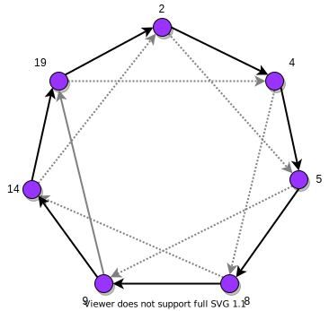

# P2P-system
A [peer-to-peer file sharing](https://en.wikipedia.org/wiki/Peer-to-peer_file_sharing) system built with a [Chord](https://en.wikipedia.org/wiki/Chord_(peer-to-peer)) [distributed hash table (DHT)](https://en.wikipedia.org/wiki/Distributed_hash_table) as the infrastructure. The system supports the following 5 P2P services:
<ol>
  <li><b>Data insertion:</b> An external entity can request any peer to store a new data record into the distributed database implemented as the DHT.</li>
  <li><b>Data retrieval:</b> An external entity can request any peer to retrieve a data record from the DHT.</li>
  <li><b>Peer joining:</b> A new peer can approach any of the existing peers to join the DHT.</li>
  <li><b>Peer departure(graceful):</b> A peer can gracefully leave the DHT by announcing its departure to other relevant peers before shutting down.</li>
  <li><b>Peer departure(abrupt):</b> Peers can depart abruptly, e.g., by “killing” a peer process using CTRL-C command.</li>
</ol>

## Usage
Clone the repo or down load a zip file.
### 1. Initialize the network
On a linux terminal (requires Python3 and [X server](https://en.wikipedia.org/wiki/X_Window_System)):
```
cd src
chmod 755 Dht.py init.sh
./init.sh
```
This will start a network with 7 peers as depicted below. The number aside each node is it's ID, a valid ID is an integer in the range [0, 255]. 
The two outgoing arrows from a node indicate it's successors in the network. The peers start pinging its successors immediately upon initialization, see [report.pdf - 2.2 Ping Successors](./report.pdf) for details on how peers ping through UDP connetction and detect the status of its successors.



### 2. Peer Joining
After being initialized, new peers can join the P2P network via any existing peer by executing the following command:
```
python3 Dht.py join <new peerID> <existing peerID> <ping interval>
```
The argument `join` envoke the joining process and the follwing 2 arguments specify IDs of the new peer and an existing peer, while the last argument specifies the interval at which the new peer will ping its successors after joining the network. For example, the command below says a peer of ID 25 will join the network via peer 4, and it will ping its successors every 10 ms:
```
python3 Dht.py join 25 4 10
```
**Peer 4** forwards the joining request and then informs **peer 25** of its position in the network when the information is returned, see [report.pdf - 2.3 Ping Joining](./report.pdf) for details on how the joining request is forwarded and how a new peer gets informed of its correct position in the network.

### 3. Peer Departure
A peer may leave the network at any time, may it be its wish or by accident. A peer quits the network gracefully by the command `Quit` or abruptly because of system or network failure, the system is capable of dealing with any type of peer departure and reassign successors to existing peers.

### 4. Data Insertion (Uploading) & Retrieval (Downloading)
A file stored in the system has a unique file ID which is a hashing value, and it is stored in the table of the peer with an ID that is the closest to `fileID mod 256`.

Data insertion:
```
Store <file_id>
```

Data retrieval:
```
Request <file_id>
```
